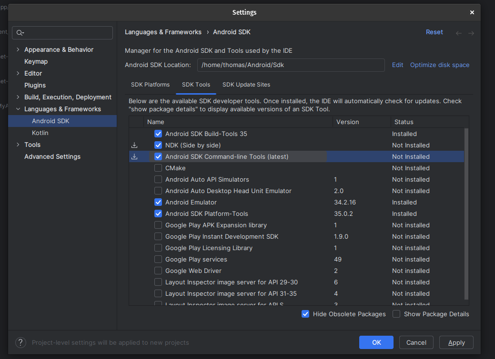

# Rust In Android

Because there are a lot of starknet libraries in rust, and the beerus client
is written in rust, being able to run rust code on android is important
for reaching MVP.

The process for running a minimal rust "hello world" library on android is
as follows:

## Get dependencies

Install NDK from android studio


Add rust dependencies

```bash
cargo install cargo-ndk
rustup target add x86_64-linux-android
```

Update Cargo.toml

```toml
[lib]
crate-type = ["cdylib"]
```

```toml
[dependencies]
jni = "0.21.1"
```

## Implement the Java side

We will be creating a Java class to interact with our rust library as follows:

```java
package com.example.rust_example;

public class RustLib {

    // define the interface for using the rust library below
    public static native String hello(String input);

    static {
        // here we load the rust library we created
        System.loadLibrary("example_rust_project");
    }
}
```

## Writing the rust side

We will writing rust code that compiles as C code to match the C header generated
when compiling the Java library created in the previous step.
Use javac to compile the Java class into a C header.

```bash
javac RustLib.java -h .
```

The output is shown below:

```c
/* DO NOT EDIT THIS FILE - it is machine generated */
#include <jni.h>
/* Header for class com_example_rust_example_RustLib */

#ifndef _Included_com_example_rust_example_RustLib
#define _Included_com_example_rust_example_RustLib
#ifdef __cplusplus
extern "C" {
#endif
/*
 * Class:     com_example_rust_example_RustLib
 * Method:    hello
 * Signature: (Ljava/lang/String;)Ljava/lang/String;
 */
JNIEXPORT jstring JNICALL Java_com_example_rust_1example_RustLib_hello
  (JNIEnv *, jclass, jstring);

#ifdef __cplusplus
}
#endif
#endif
```

Now we implement this C header in rust.

```rust
use jni::{
    objects::{JClass, JString},
    sys::jstring,
    JNIEnv,
};

use super::hello;

#[no_mangle]
pub extern "C" fn Java_com_example_rust_1example_RustLib_hello<'local>(
    mut env: JNIEnv<'local>, // this is the class that owns our static method
    _class: JClass<'local>,
    input: JString<'local>,
) -> jstring {
    // getting the input string from our android app out of java
    let input: String = env
        .get_string(&input)
        .expect("Couldn't get java string!")
        .into();

    // creating a new java string to return to our android app
    let output = env
        .new_string(hello(&input))
        .expect("Couldn't create a java string!");

    output.into_raw()
}
```

## Building for android

Run

```bash
make build-android
```

Copy the .so file from 'target/x86_64-linux-android/release/libexample_rust_project.so'
to 'app/src/main/jni/x86_64/libexample_rust_project.so' so the android app can read
compiled native code.

Use the library like any other library.

```java
package com.example.rust_example

import androidx.appcompat.app.AppCompatActivity
import android.os.Bundle

class MainActivity : AppCompatActivity() {

    override fun onCreate(savedInstanceState: Bundle?) {
        super.onCreate(savedInstanceState)
        setContentView(R.layout.activity_main)

        val result = RustLib.hello("TEST")
        println(result)
    }
}
```
