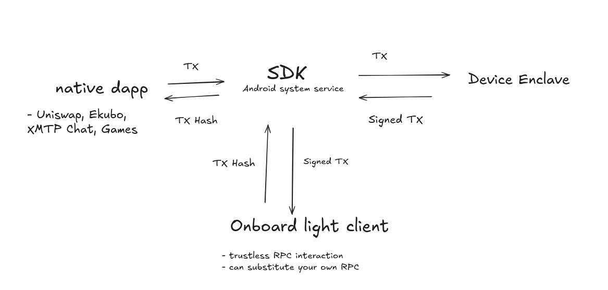

# Whitepaper (WIP)

## Intro

The end goal, at least as professed by most blockchain organizations, of blockchain networks, is decentralization.
At its best, it will be a bastion of freedom and security, with peers transacting freely with each other without revealing 
their identity. To fully realize this goal, permissionless communication with the network is required. To acheive this 
right now, people can run their own nodes on their own servers and communicate with the network that way. This is 
both technically challenging, and often expensive, thus becoming prohibitive for users where it is not feasible to do 
even if desired. True adoption of decentralized networks will not take place until it is easier to use them than not.

## How it works 

### WalletSDK

The WalletSDK runs as an OS level system service, allowing it to be available for all native apps running on the OS.

### Hardware Signer

Android (Pixel specifically) devices have the ability to sign transactions on an embedded secure element, providing 
similar security to a cold wallet like a Ledger or Trezor. 

### Hardware Signer 

## Why Android

Already, the most recommended and commonplace way to secure private keys is with a hardware device such as a Ledger 
or Trezor. While these devices do not sacrifice on security, they do sacrifice on user experience. Connecting them to 
a browser based wallet is ardous, and is a blocker for dApp users who value security. Today, TEEs on Android devices 
are good enough to serve this purpose, and allow for interaction with the already robust Android app infrastructure. 

Furthermore, mobile devices have sensors and data (camera, geolocation, NFC) which can be used by onchain applications, 
to unlock previously impossible capabilities. 

## Why Starknet

Two of the largest blockchain networks already have device offerings. Those being the Solana Saga and Seeker, as well 
as the upcoming dGEN1, which will be shipping with an Ethereum light client on-board. While both of these devices 
are innovative in their respective ways, Starknet has some unique properties that makes more sense from a consumer 
device standpoint. 

Signing will happen using an on-device TEE, such that the private key used for signing is not 
exportable from the device. This prevents the key from being extracted in the case of theft, but also means 
that the key is lost if the device is lost. Account Abstraction on Starknet allows for a system of Gaurdians, where 
multiple signers can be used to secure an account, and transfer signing capability in the case of a lost device. 

Furthermore, 
Starknet is proving itself to be a hub for onchain games. Many of these games would benefit from being played on a mobile
and/or dedicated device where transaction signing can be handled by the OS and moved out of their immediate attention.
Native dApps, (both games and financial) can easily interact with a simple API provided by the OS. 

## References 

[TEE on android](https://source.android.com/docs/security/features/keystore)
